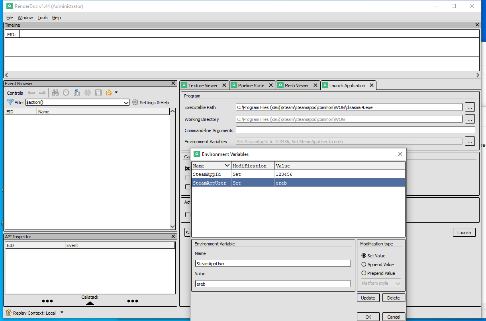
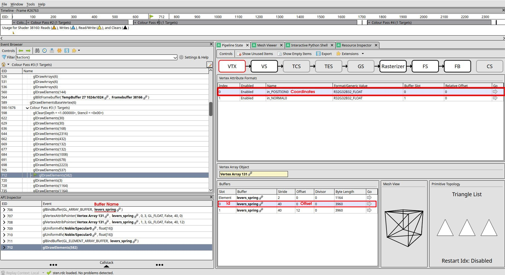
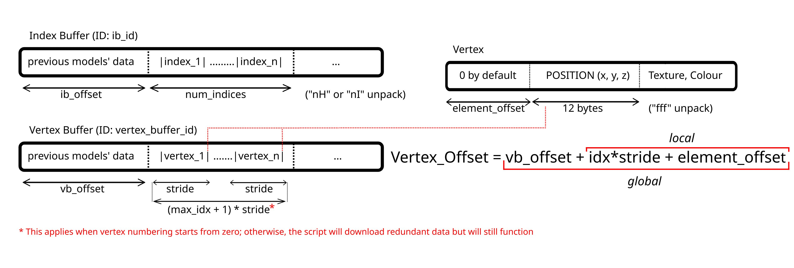
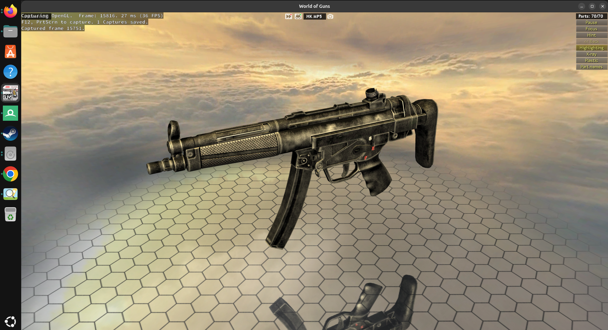
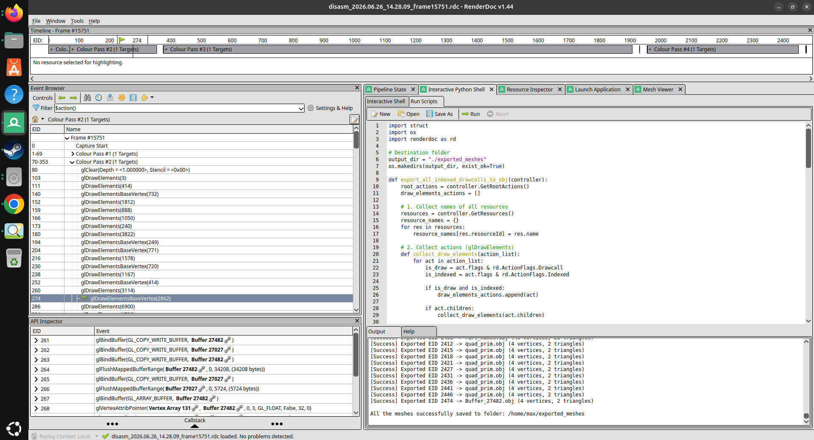
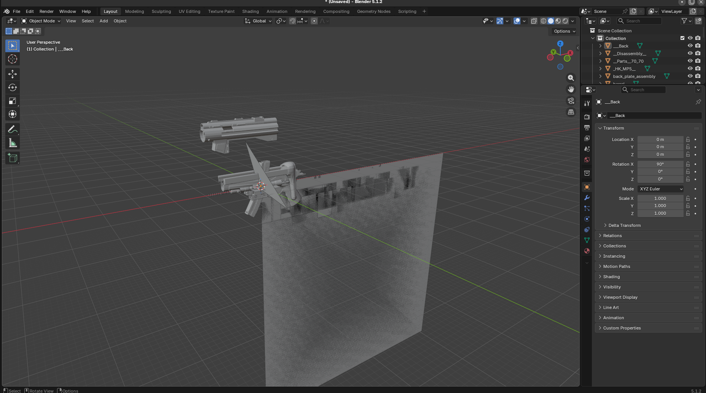
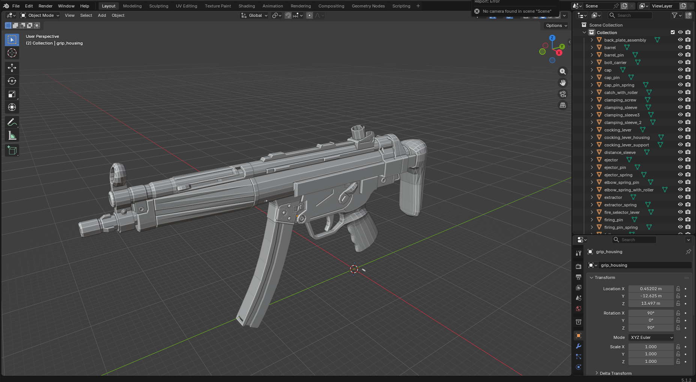

# RenderDoc-3D-Mesh-OBJ-Exporter
### Automated tool to extract all the meshes in OBJ format from RenderDoc captures, that was originally written for extracting firearms from World of Guns: Gun Disassembly

## These scripts have been successfully tested with RenderDoc 1.44 and WOG: the OpenGL version was tested under Linux Ubuntu 26.04, while the DirectX 11 version was tested under Windows 10.

### Before using the script run a game and take a capture. 
* In RenderDocRun the .exe or .x86. On Windows set 2 environment variables: SteamAppId and SteamAppUser - you can find them in Task Manager, after running the game via Steam - to launch the game using your Steam profile.
* On linux make a file "steam_appid.txt" with the game's id: e.g. 262410 for WOG.

### Both scripts must be run from RenderDoc's own Python shell. Set the output dir and launch it. Optionally change it:

* "attr_index = 0" - You can find it in Pipeline State Vertex Attribute Formats in Index column
* "x, y, z = struct.unpack_from('fff', vertex_bytes, 0)" - There is also a vertex coordinate size in bits. If it is "R16G16B16" use "eee" or "hhh" instead of "fff" 
* "vertex_bytes = buffer_bytes[vertex_offset : vertex_offset + 12]" - And +6 instead of +12

### Use this diagram to understand how scripts compute vertex coordinates and binary array offsets.

### Example

